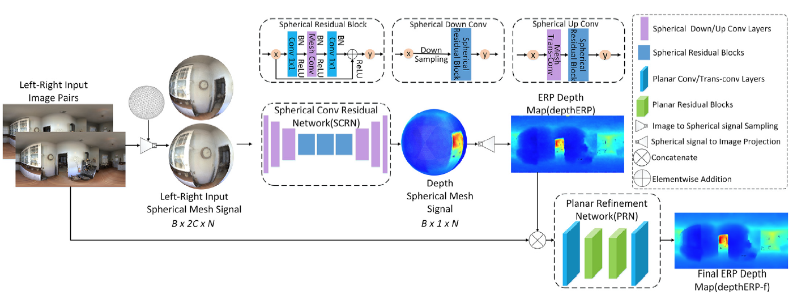

# CSDNet
Pytorch implmentation of [CSDNet (2021) - Omnidirectional stereo depth estimation based on spherical
deep network](https://www.sciencedirect.com/science/article/abs/pii/S0262885621001694)

## Introduction

This paper proposes a novel approach that use spherical CNNs and the epipolar constraint on sphere for omnidirectional depth estimation.

CSDNet using a cascade structure to obtain depth maps from left and right 360$^\circ$ images. First convert the ERP domain 360$^\circ$ images to sphere signals and use Spherical Convolution Residual Network (SCRN) to estimate initial depth maps. Then finetune the results based on the initial depth maps and left & right RGB images via the Planar Refinement Network (PRN).

SCRN is built with the [Mesh CNNs](http://www.maxjiang.ml/proj/ugscnn), which is a type of spherical convolution that convert imgaes to sphere signals and then adopt the convolution operator. SCRN is used for depth estimation of sphere signals.

PRN is a planar refinement network and ti is used to refine the depth maps on ERP domain.

## Requirements
pytorch >= 1.6.0

numpy

igl

scipy

## Dataset

We use the dataset [3D60](https://vcl3d.github.io/3D60/). It comprises multi-modal stereo renders of scenes from realistic and synthetic large-scale 3D datasets (Matterport3D, Stanford2D3D, SunCG).

The structure of the dataset folder is as follow:
```
3D60
├── Center_Left_Down
    │ ├── Matterport3D
    │   ├── xxx_color_0_Left_Down_0.0.png
    │   ├── xxx_depth_0_Left_Down_0.0.exr
    │ ├── Stanford2D3D
    │ ├── SunCG
├── Right
    │ ├── Matterport3D
    │   ├── xxx_color_0_Right_0.0.png
    │   ├── xxx_depth_0_Right_0.0.exr
    │ ├── Stanford2D3D
    │ ├── SunCG
├── Up
    │ ├── Matterport3D
    │   ├── xxx_color_0_Up_0.0.png
    │   ├── xxx_depth_0_Up_0.0.exr
    │ ├── Stanford2D3D
    │ ├── SunCG
```

## Usage

### install requirements

Please install the required packages above before running the training and testing codes.

### generate mesh files
To run the CSDNet, you need to generate the mesh CNN files first. The mesh files indicate the rules that sample ERP images to sphere signals.

```python gen_mesh.py```

This will create a direcoty names "meshfiles" and 8 mesh files in it. The number in the name of each file is the mesh level. Briefly, the higher the level is, the more sampling points that the mesh contais.

### *generate mesh2ERP interpolation maps*
The mesh2ERP interpolation maps is used to re-project the sphere signals to ERP images.
If the file './interMapFiles/interMap_6-1d.npy' does not exist, please run
```python gen_interMap.py```
 to genearte the file. 

If you need to run the model with different mesh levels, please modified the parameters in gen_interMap.py and run the command above.

### train CSDNet
Follow this example to train

```python train.py --train_files [path to train list] --val_files [path to validation list]```

### test CSDNet
Follow this example to test

```python test.py --filename_list [path to test list] --dataset_root [path to dataset] --load_ckpt [path to checkpoint] --spherical_metrics --save_output --save_dir [path to directory to save results]```

## Note
1. The Mesh CNN is generated and used with reference to [maxjiang93/ugscnn](https://github.com/maxjiang93/ugscnn). The codes of spherical utils (i.e. sperical weights, smoothness loss) and dataloader reference [VCL3D/SphericalViewSynthesis](https://github.com/VCL3D/SphericalViewSynthesis). We sincerely appericiate these exciting and helpful works.
2. We use the same dataloader for 3D60 and all other relevant datasets (Matterport3D, Stanford2D3D, SunCG), just choose different file_list.txt to control the input data.
3. The train/val/test split of 3D60 that we used is one of the official splits in [VCL3D/3D60](https://github.com/VCL3D/3D60). For the datasets Matterport3D and SunCG, we used our own splits.
## Citation
If you find this project helpful in your research, welcome to cite the paper.
```
@article{Li2021csdnet,
  title    = {Omnidirectional stereo depth estimation based on spherical deep network},
  journal  = {Image and Vision Computing},
  volume   = {114},
  pages    = {104264},
  year     = {2021},
  issn     = {0262-8856},
  doi      = {https://doi.org/10.1016/j.imavis.2021.104264},
  url      = {https://www.sciencedirect.com/science/article/pii/S0262885621001694},
  author   = {Ming Li and Xuejiao Hu and Jingzhao Dai and Yang Li and Sidan Du},
  keywords = {Omnidirectional depth estimation, Spherical convolutional network, Stereo matching, Cascade learning}
}
```